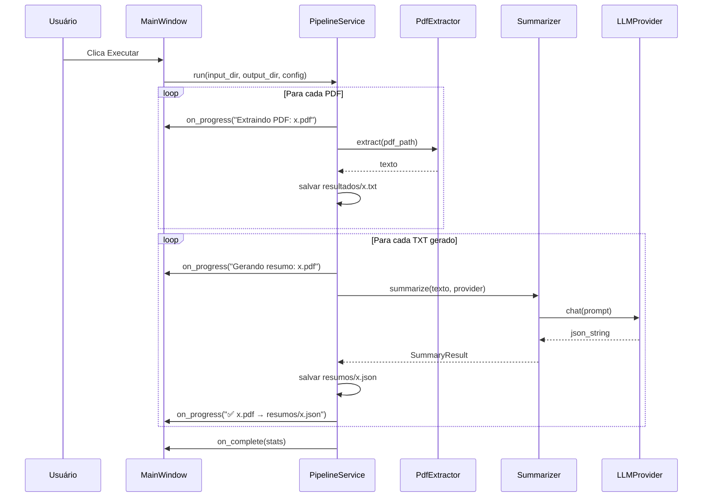

# Fase 0 — Especificação SDD + TDD

**Projeto:** PDF Summarizer (py-rag-local-bot)  
**Versão do documento:** 0.1  
**Data:** 2026-06-26  
**Status:** Implementado

---

## 1. Visão geral

### 1.1 Objetivo

Centralizar o pipeline existente (extração de PDF → texto → resumo JSON via LLM) em uma **aplicação desktop Python** com arquitetura modular, testável e preparada para empacotamento como **executável Windows** (PyInstaller).

### 1.2 Problema atual

O repositório possuía três scripts independentes (agora em `legacy/`):

| Script | Responsabilidade |
|--------|------------------|
| `legacy/pdf_extractor.py` | PDF → `.txt` em `resultados/` |
| `legacy/summarize.py` | `.txt` → `.json` via Ollama local |
| `legacy/summarize-open-router.py` | `.txt` → `.json` via OpenRouter |

Há duplicação de lógica (schema JSON, parse de resposta, loop de arquivos) e nenhuma interface unificada.

### 1.3 Resultado esperado da Fase 0

Um projeto Python estruturado em camadas, com **testes automatizados desde o início (TDD)**, contendo:

- Core desacoplado da UI (testável sem GUI)
- Entrada configurável: **pasta de PDFs** e **pasta de saída**
- LLM parametrizável: **Ollama (local)** ou **OpenRouter (API key)**
- Interface gráfica mínima com botão **Executar** e log de passos em tempo real
- Base pronta para gerar `.exe` via PyInstaller (build não é escopo de implementação da Fase 0, mas a arquitetura deve suportá-lo)

---

## 2. Escopo da Fase 0

### 2.1 Dentro do escopo

- [x] Refatorar lógica existente para módulos `core/`
- [x] Pipeline orquestrado: PDF → TXT → JSON
- [x] Abstração de provider LLM (Strategy Pattern)
- [x] Configuração persistente (provider, modelo, API key, pastas)
- [x] GUI desktop (CustomTkinter) com seleção de pastas e execução
- [x] Log de progresso passo a passo na UI
- [x] Suite de testes unitários e de integração (pytest)
- [x] `requirements.txt` e estrutura de pacote instalável
- [x] Documentação mínima de execução (`README` atualizado na Fase 1)

### 2.2 Fora do escopo (Fase 0)

- Empacotamento PyInstaller / instalador Inno Setup
- Chunking de textos longos (> MAX_CHARS)
- RAG / busca semântica / vector store
- Drag-and-drop de arquivos individuais
- Histórico de processamentos / banco de dados
- Suporte Linux/macOS na GUI
- Internacionalização (i18n)
- Tema dark/light avançado

---

## 3. Requisitos funcionais

### RF-01 — Seleção de pastas

| ID | Descrição |
|----|-----------|
| RF-01.1 | O usuário deve selecionar uma **pasta de entrada** contendo arquivos `.pdf`. |
| RF-01.2 | O usuário deve selecionar uma **pasta de saída** onde serão gravados os artefatos. |
| RF-01.3 | A pasta de saída deve conter subpastas `resultados/` (`.txt`) e `resumos/` (`.json`). |
| RF-01.4 | Pastas inválidas ou inexistentes devem ser criadas automaticamente (com permissão de escrita). |
| RF-01.5 | Se a pasta de entrada não contiver PDFs, o sistema deve informar e não iniciar processamento. |

### RF-02 — Configuração de LLM

| ID | Descrição |
|----|-----------|
| RF-02.1 | O usuário deve escolher o **provider**: `ollama` ou `openrouter`. |
| RF-02.2 | O usuário deve informar o **modelo** (texto livre ou dropdown com valores padrão). |
| RF-02.3 | Para `openrouter`, o usuário deve informar a **API key** (campo mascarado). |
| RF-02.4 | Para `ollama`, o sistema deve validar conectividade em `http://localhost:11434` antes de processar. |
| RF-02.5 | Configurações devem persistir entre sessões em arquivo local (`%APPDATA%/PDFSummarizer/config.json`). |
| RF-02.6 | Valores padrão de modelo: `gemma3:270m` (Ollama), `nvidia/nemotron-3-super-120b-a12b:free` (OpenRouter). |

### RF-03 — Execução do pipeline

| ID | Descrição |
|----|-----------|
| RF-03.1 | Botão **Executar** inicia o pipeline para todos os PDFs da pasta de entrada. |
| RF-03.2 | Ordem de processamento: extrair texto de cada PDF, depois gerar resumo JSON de cada TXT. |
| RF-03.3 | Cada etapa deve emitir evento de progresso consumível pela UI. |
| RF-03.4 | Falha em um arquivo não deve abortar os demais (fail-soft por arquivo). |
| RF-03.5 | Ao final, exibir resumo: total processado, sucesso, falhas. |

### RF-04 — Log de passos na UI

| ID | Descrição |
|----|-----------|
| RF-04.1 | A UI deve exibir mensagens em tempo real, por exemplo: |
| | `Extraindo PDF: documento_a.pdf` |
| | `Extraindo PDF: documento_b.pdf` |
| | `Gerando resumo: documento_a.pdf` |
| | `Gerando resumo: documento_b.pdf` |
| RF-04.2 | Mensagens de erro devem ser exibidas com identificação do arquivo (`❌ documento_x.pdf: motivo`). |
| RF-04.3 | Mensagens de sucesso devem indicar caminho relativo de saída (`✅ documento_x.pdf → resumos/documento_x.json`). |
| RF-04.4 | Durante execução, botão Executar fica desabilitado; reabilitado ao término. |

### RF-05 — Formato de saída

| ID | Descrição |
|----|-----------|
| RF-05.1 | TXT: texto puro extraído via `pdfplumber`, UTF-8, mesmo `stem` do PDF. |
| RF-05.2 | JSON: estrutura compatível com a existente (ver seção 6.3). |
| RF-05.3 | Textos vazios após extração são ignorados (skip) com log informativo. |
| RF-05.4 | Truncamento em `MAX_CHARS` (configurável, default 8000 Ollama / 10000 OpenRouter) com aviso no log. |

---

## 4. Requisitos não funcionais

| ID | Requisito |
|----|-----------|
| RNF-01 | Core testável sem dependência de GUI (cobertura mínima 80% em `core/`). |
| RNF-02 | Chamadas LLM executadas em thread separada; UI responsiva. |
| RNF-03 | API key nunca logada em texto claro. |
| RNF-04 | Código segue PEP 8; type hints em interfaces públicas. |
| RNF-05 | Dependências pinadas em `requirements.txt`. |
| RNF-06 | Estrutura compatível com PyInstaller (`sys._MEIPASS`, paths relativos). |
| RNF-07 | Tempo de startup da GUI < 3s em máquina média. |

---

## 5. Arquitetura

### 5.1 Princípios

1. **Separation of Concerns** — UI, orquestração, domínio e infraestrutura em camadas distintas.
2. **Dependency Inversion** — Pipeline depende de abstrações (`LLMProvider`), não de Ollama/OpenRouter diretamente.
3. **Testability First (TDD)** — Toda feature começa com teste falhando; implementação mínima para passar.
4. **Executable-ready** — Entry point único (`app.py`); sem paths hardcoded; config externa.

### 5.2 Diagrama de camadas

```
┌─────────────────────────────────────────────────────────┐
│  Presentation (ui/)                                     │
│  CustomTkinter — pastas, provider, log, botão Executar  │
└──────────────────────────┬──────────────────────────────┘
                           │ callbacks / events
┌──────────────────────────▼──────────────────────────────┐
│  Application (services/)                                │
│  PipelineService — orquestra extração + resumo          │
└──────────────────────────┬──────────────────────────────┘
                           │
        ┌──────────────────┼──────────────────┐
        ▼                  ▼                  ▼
┌───────────────┐  ┌───────────────┐  ┌───────────────────┐
│ core/pdf/     │  │ core/summary/ │  │ infra/providers/  │
│ PdfExtractor  │  │ Summarizer    │  │ OllamaProvider    │
│               │  │ Schema/Parser │  │ OpenRouterProvider│
└───────────────┘  └───────────────┘  └───────────────────┘
        │                  │                  │
        └──────────────────┴──────────────────┘
                           │
┌──────────────────────────▼──────────────────────────────┐
│  Infrastructure (infra/)                                │
│  ConfigStore, FileSystem, HttpClient (Ollama health)    │
└─────────────────────────────────────────────────────────┘
```

### 5.3 Fluxo de execução



### 5.4 Estrutura de diretórios proposta

```
py-rag-local-bot/
├── app.py                      # Entry point (GUI + futuro PyInstaller)
├── pyproject.toml              # Metadados do pacote (opcional Fase 0)
├── requirements.txt
├── requirements-dev.txt        # pytest, pytest-cov, pytest-mock
├── fase0spec.MD                # Este documento
│
├── src/
│   └── pdf_summarizer/
│       ├── __init__.py
│       ├── __main__.py         # python -m pdf_summarizer
│       │
│       ├── core/
│       │   ├── __init__.py
│       │   ├── models.py       # dataclasses: JobConfig, ProgressEvent, SummaryResult
│       │   ├── exceptions.py   # PdfExtractError, LlmError, ConfigError
│       │   ├── pdf/
│       │   │   ├── __init__.py
│       │   │   └── extractor.py
│       │   └── summary/
│       │       ├── __init__.py
│       │       ├── schema.py   # FORMATO_RESPOSTA, parse_resposta_json
│       │       └── summarizer.py
│       │
│       ├── infra/
│       │   ├── __init__.py
│       │   ├── config_store.py
│       │   ├── filesystem.py
│       │   └── providers/
│       │       ├── __init__.py
│       │       ├── base.py     # Protocol LLMProvider
│       │       ├── ollama.py
│       │       └── openrouter.py
│       │
│       ├── services/
│       │   ├── __init__.py
│       │   └── pipeline.py     # PipelineService
│       │
│       └── ui/
│           ├── __init__.py
│           ├── main_window.py
│           └── widgets/
│               ├── folder_picker.py
│               └── log_panel.py
│
├── tests/
│   ├── conftest.py             # fixtures: tmp_path, mock_provider, sample_pdf
│   ├── unit/
│   │   ├── test_pdf_extractor.py
│   │   ├── test_schema.py
│   │   ├── test_summarizer.py
│   │   ├── test_pipeline.py
│   │   ├── test_ollama_provider.py
│   │   └── test_openrouter_provider.py
│   └── integration/
│       └── test_pipeline_e2e.py  # PDF fake → TXT → JSON (provider mockado)
│
├── fixtures/                   # PDFs/textos de teste (pequenos, versionados)
│   ├── sample.pdf
│   └── sample.txt
│
└── legacy/                     # Scripts originais (referência, deprecados)
    ├── pdf_extractor.py
    ├── summarize.py
    └── summarize-open-router.py
```

> **Nota:** Os scripts atuais na raiz podem permanecer temporariamente; após Fase 0 concluída, mover para `legacy/` ou remover.

---

## 6. Contratos e interfaces

### 6.1 Modelos de domínio (`core/models.py`)

```python
@dataclass
class JobConfig:
    input_dir: Path
    output_dir: Path
    provider: Literal["ollama", "openrouter"]
    model: str
    api_key: str | None          # obrigatório se provider == openrouter
    max_chars: int = 8000

@dataclass
class ProgressEvent:
    stage: Literal["extract", "summarize", "info", "error", "done"]
    filename: str
    message: str

@dataclass
class PipelineStats:
    pdfs_found: int
    extracted: int
    summarized: int
    skipped: int
    failed: int

@dataclass
class SummaryResult:
    modelo: str
    requisicao: str | dict
    resposta: dict
```

### 6.2 Protocolo LLMProvider (`infra/providers/base.py`)

```python
class LLMProvider(Protocol):
    def summarize(self, texto: str, model: str) -> SummaryResult: ...
    def health_check(self) -> bool: ...
```

Implementações:

- `OllamaProvider` — usa biblioteca `ollama`, `format=FORMATO_RESPOSTA`
- `OpenRouterProvider` — usa `openai` client com `base_url` OpenRouter, `response_format=json_object`

Factory:

```python
def create_provider(config: JobConfig) -> LLMProvider:
    ...
```

### 6.3 Schema JSON de resposta (contrato estável)

```json
{
  "modelo": "string",
  "requisicao": "string | object",
  "resposta": {
    "resumo": "string",
    "pontos_principais": ["string"],
    "informacoes_importantes": ["string"],
    "assuntos": ["string"]
  }
}
```

Campos `resposta.*` são **obrigatórios** após parse. Provider deve garantir presença ou levantar `LlmParseError`.

### 6.4 PipelineService (`services/pipeline.py`)

```python
class PipelineService:
    def __init__(
        self,
        extractor: PdfExtractor,
        summarizer: Summarizer,
        filesystem: FileSystem,
        on_progress: Callable[[ProgressEvent], None] | None = None,
    ): ...

    def run(self, config: JobConfig) -> PipelineStats:
        """
        1. Lista PDFs em config.input_dir
        2. Para cada PDF: extrai → grava output_dir/resultados/{stem}.txt
        3. Para cada TXT gerado: resume → grava output_dir/resumos/{stem}.json
        4. Emite ProgressEvent a cada passo
        5. Retorna estatísticas finais
        """
```

---

## 7. Interface gráfica (Fase 0)

### 7.1 Wireframe textual

```
┌──────────────────────────────────────────────────────────────┐
│  PDF Summarizer                                         [_][□][X]│
├──────────────────────────────────────────────────────────────┤
│  Pasta de PDFs:    [ C:\docs\pdfs          ] [ Procurar... ] │
│  Pasta de saída:   [ C:\docs\saida         ] [ Procurar... ] │
│                                                              │
│  Provider:  (•) Ollama local    ( ) OpenRouter               │
│  Modelo:    [ gemma3:270m                    ▼ ]             │
│  API Key:   [ •••••••••••••••••••••••••••• ]  (se OpenRouter)│
│                                                              │
│  [                    ▶ Executar                         ]   │
│                                                              │
│  Log:                                                        │
│  ┌────────────────────────────────────────────────────────┐  │
│  │ Extraindo PDF: Orientações_início das aulas.pdf        │  │
│  │ Extraindo PDF: Profile.pdf                             │  │
│  │ Gerando resumo: Orientações_início das aulas.pdf       │  │
│  │ ✅ Orientações... → resumos/Orientações....json       │  │
│  │ Gerando resumo: Profile.pdf                            │  │
│  │ ✅ Profile.pdf → resumos/Profile.json                  │  │
│  │ ── Concluído: 2 extraídos, 2 resumos, 0 falhas ──      │  │
│  └────────────────────────────────────────────────────────┘  │
└──────────────────────────────────────────────────────────────┘
```

### 7.2 Comportamento UI

| Elemento | Comportamento |
|----------|---------------|
| Procurar... | `tkinter.filedialog.askdirectory` |
| Provider | Alterna visibilidade do campo API Key |
| Executar | Valida config → desabilita controles → thread worker → `PipelineService.run()` |
| Log | `ScrolledText`, append-only, auto-scroll |
| Fechar durante execução | Confirmar cancelamento (Fase 1: cancel token) |

---

## 8. Estratégia TDD

### 8.1 Ciclo Red → Green → Refactor

Cada entrega de Fase 0 segue:

1. **Red** — Escrever teste que falha descrevendo comportamento desejado.
2. **Green** — Implementação mínima para passar.
3. **Refactor** — Limpar duplicação mantendo testes verdes.

Ordem de implementação (dependências primeiro):

```
schema → pdf_extractor → providers (mock) → summarizer → pipeline → config_store → ui
```

### 8.2 Pirâmide de testes

| Camada | Ferramenta | Foco |
|--------|------------|------|
| Unit | pytest + pytest-mock | Funções puras, parsers, validações |
| Integration | pytest + tmp_path | Pipeline com filesystem real, LLM mockado |
| UI | Manual (Fase 0) | Smoke test da janela; automação em Fase 2 |

### 8.3 Casos de teste obrigatórios (Fase 0)

#### `tests/unit/test_schema.py`

| Teste | Comportamento |
|-------|---------------|
| `test_parse_json_puro` | JSON válido retorna dict |
| `test_parse_json_com_markdown_fence` | Remove ```json ... ``` |
| `test_parse_json_invalido_levanta_erro` | JSON malformado → exceção |

#### `tests/unit/test_pdf_extractor.py`

| Teste | Comportamento |
|-------|---------------|
| `test_extrair_pdf_com_texto` | Retorna string não vazia |
| `test_extrair_pdf_vazio` | Retorna string vazia |
| `test_extrair_arquivo_inexistente` | Levanta `PdfExtractError` |

#### `tests/unit/test_summarizer.py`

| Teste | Comportamento |
|-------|---------------|
| `test_trunca_texto_acima_max_chars` | Texto cortado + flag truncado |
| `test_summarize_delega_provider` | Mock provider recebe prompt correto |
| `test_summarize_campos_obrigatorios` | Valida presença de campos required |

#### `tests/unit/test_pipeline.py`

| Teste | Comportamento |
|-------|---------------|
| `test_run_sem_pdfs` | Retorna stats zerado, emite info |
| `test_run_extrai_e_resume` | 2 PDFs → 2 TXT + 2 JSON |
| `test_run_falha_em_um_arquivo_continua` | 1 falha LLM, 1 sucesso |
| `test_run_emite_progress_events` | Callback recebe eventos na ordem |
| `test_run_cria_subpastas` | `resultados/` e `resumos/` criadas |

#### `tests/unit/test_ollama_provider.py`

| Teste | Comportamento |
|-------|---------------|
| `test_health_check_ok` | Mock HTTP 200 → True |
| `test_health_check_offline` | ConnectionError → False |
| `test_summarize_chama_ollama_chat` | Mock `ollama.chat` |

#### `tests/unit/test_openrouter_provider.py`

| Teste | Comportamento |
|-------|---------------|
| `test_summarize_sem_api_key_levanta_erro` | ConfigError |
| `test_summarize_chama_openai_client` | Mock completions.create |

#### `tests/integration/test_pipeline_e2e.py`

| Teste | Comportamento |
|-------|---------------|
| `test_pipeline_completo_com_mock_llm` | PDF fixture → arquivos em disco → JSON válido |

### 8.4 Fixtures (`tests/conftest.py`)

```python
@pytest.fixture
def tmp_output_dir(tmp_path): ...

@pytest.fixture
def mock_llm_provider(): ...  # retorna SummaryResult fixo

@pytest.fixture
def sample_pdf_path(fixtures_dir): ...  # fixtures/sample.pdf
```

### 8.5 Comando de testes

```bash
pytest tests/ -v --cov=src/pdf_summarizer --cov-report=term-missing
```

**Gate de qualidade Fase 0:** todos os testes passando; cobertura ≥ 80% em `core/` e `services/`.

---

## 9. Configuração e persistência

### 9.1 Arquivo de configuração

**Local:** `%APPDATA%/PDFSummarizer/config.json` (Windows)

```json
{
  "input_dir": "C:/docs/pdfs",
  "output_dir": "C:/docs/saida",
  "provider": "openrouter",
  "model": "nvidia/nemotron-3-super-120b-a12b:free",
  "api_key": "sk-or-...",
  "max_chars": 10000
}
```

### 9.2 Prioridade de configuração

1. Valores da UI (sessão atual)
2. `config.json` persistido
3. Variáveis de ambiente (`OPENROUTER_API_KEY` — compatibilidade com `.env` atual)
4. Defaults hardcoded

### 9.3 Compatibilidade com `.env` existente

`python-dotenv` carregado no startup; `OPENROUTER_API_KEY` usado se `config.json` não tiver key.

---

## 10. Dependências

### 10.1 Runtime (`requirements.txt`)

```
pdfplumber>=0.11.0
ollama>=0.4.0
openai>=1.0.0
python-dotenv>=1.0.0
customtkinter>=5.2.0
```

### 10.2 Desenvolvimento (`requirements-dev.txt`)

```
pytest>=8.0.0
pytest-cov>=5.0.0
pytest-mock>=3.14.0
```

---

## 11. Preparação para executável (design constraints)

Embora o build PyInstaller seja Fase 1, a Fase 0 deve respeitar:

| Constraint | Implementação |
|------------|---------------|
| Entry point único | `app.py` chama `ui.main_window.main()` |
| Paths portáveis | `pathlib.Path`; nunca assumir CWD |
| Recursos embarcados | `resources/` para ícone (futuro) |
| Config fora do exe | `%APPDATA%`, não dentro do bundle |
| Imports explícitos | Evitar imports dinâmicos que quebrem PyInstaller |

Comando de build previsto (Fase 1):

```bash
pyinstaller --onedir --windowed --name PDFSummarizer app.py
```

---

## 12. Plano de entrega incremental (TDD)

| Sprint | Entrega | Testes primeiro |
|--------|---------|-----------------|
| **S0.1** | Estrutura `src/`, `tests/`, models, exceptions | `test_models`, `test_exceptions` |
| **S0.2** | `schema.py` + `pdf/extractor.py` | `test_schema`, `test_pdf_extractor` |
| **S0.3** | `LLMProvider` + Ollama + OpenRouter | `test_*_provider` |
| **S0.4** | `summarizer.py` | `test_summarizer` |
| **S0.5** | `pipeline.py` + `filesystem.py` | `test_pipeline`, `test_pipeline_e2e` |
| **S0.6** | `config_store.py` | `test_config_store` |
| **S0.7** | GUI `main_window.py` | smoke manual |
| **S0.8** | Integração final + README | regressão completa pytest |

---

## 13. Critérios de aceite (Definition of Done — Fase 0)

- [x] Estrutura de pastas conforme seção 5.4 implementada
- [x] `pytest` passa 100% com cobertura ≥ 80% em `core/` e `services/`
- [x] GUI permite selecionar pasta entrada/saída
- [x] GUI permite configurar provider, modelo e API key
- [x] Botão Executar processa PDFs e exibe log passo a passo
- [x] Saída em `{output_dir}/resultados/*.txt` e `{output_dir}/resumos/*.json`
- [x] JSON de saída compatível com formato existente (`OR_Profile.json`)
- [x] Config persiste entre sessões
- [x] Scripts legados documentados como substituídos pelo novo app
- [x] `python app.py` inicia a aplicação no Windows sem WSL

---

## 14. Riscos e mitigações

| Risco | Impacto | Mitigação |
|-------|---------|-----------|
| Ollama não instalado na máquina alvo | Alto | Health check + mensagem clara; default OpenRouter |
| PDF escaneado (sem texto) | Médio | Detectar TXT vazio, skip com log |
| Resposta LLM fora do schema | Médio | Retry 1x; parse robusto; log de raw response em debug |
| PyInstaller quebra pdfplumber | Médio | Testar build cedo na Fase 1; preferir `--onedir` |
| API key vazada em log | Alto | Nunca logar key; campo mascarado na UI |
| Texto > MAX_CHARS perde conteúdo | Médio | Aviso no log; chunking na Fase 2 |

---

## 15. Evolução pós-Fase 0

| Fase | Entrega |
|------|---------|
| **Fase 1** | PyInstaller, ícone, instalador, CI (GitHub Actions) |
| **Fase 2** | Chunking, cancelamento, drag-and-drop, preview de resumo |
| **Fase 3** | RAG: indexação de `assuntos`, busca local |
| **Fase 4** | Multi-plataforma (Linux/macOS) |

---

## 16. Referências internas

- `legacy/pdf_extractor.py` — lógica base de extração
- `legacy/summarize.py` — provider Ollama + schema JSON estruturado
- `legacy/summarize-open-router.py` — provider OpenRouter
- `pdfs/resumos/OR_Profile.json` — exemplo de saída esperada
- `README.MD` — setup atual (WSL/Ollama)

---

## 17. Glossário

| Termo | Definição |
|-------|-----------|
| **SDD** | Software Design Document — especificação de design |
| **TDD** | Test-Driven Development — desenvolvimento orientado a testes |
| **Provider** | Implementação concreta de backend LLM (Ollama/OpenRouter) |
| **Pipeline** | Sequência automatizada extração → resumo → persistência |
| **Fail-soft** | Continuar processamento mesmo se um item falhar |

---

*Documento vivo. Atualizar versão e status conforme decisões de implementação.*
